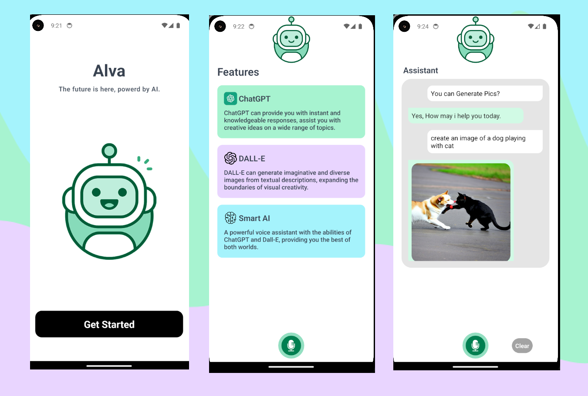

#Android--Movies-land
## Welcome! 👋

Thanks for checking out this Application. 🎉

## Screenshots

## Overview
Alva app uses artificial intelligence to generate text and images or pictures based on the user's voice commands. To use the app, simply speak your desired text or image into the microphone. The app will then generate a variety of options for you to choose from. You can then fine-tune the results by adjusting the style, color, and other parameters.

## My process

### Built with

- React Native CLI
- NativeWind with custom Styles
- Axios
- Open AI API
- Expo LinearGradient
- Heroicons
- React Native Snap Carousel
- React Native Progress
- React Native TTS
- React Native Community Voice
- JSX

## Author
- Linkedin - [@aous-shaheen-381636221](https://www.linkedin.com/in/shaheen2001/)
- Facebook - [@aoushaheen7](https://www.facebook.com/shaheen72001/)

By me 🚀🚀🚀 
Aous Shaheen ...
